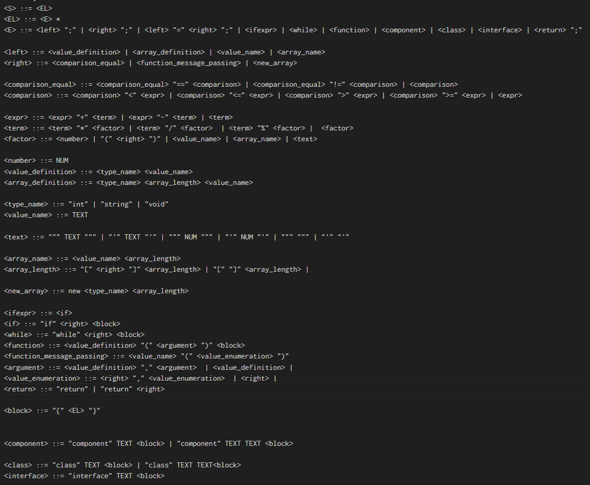
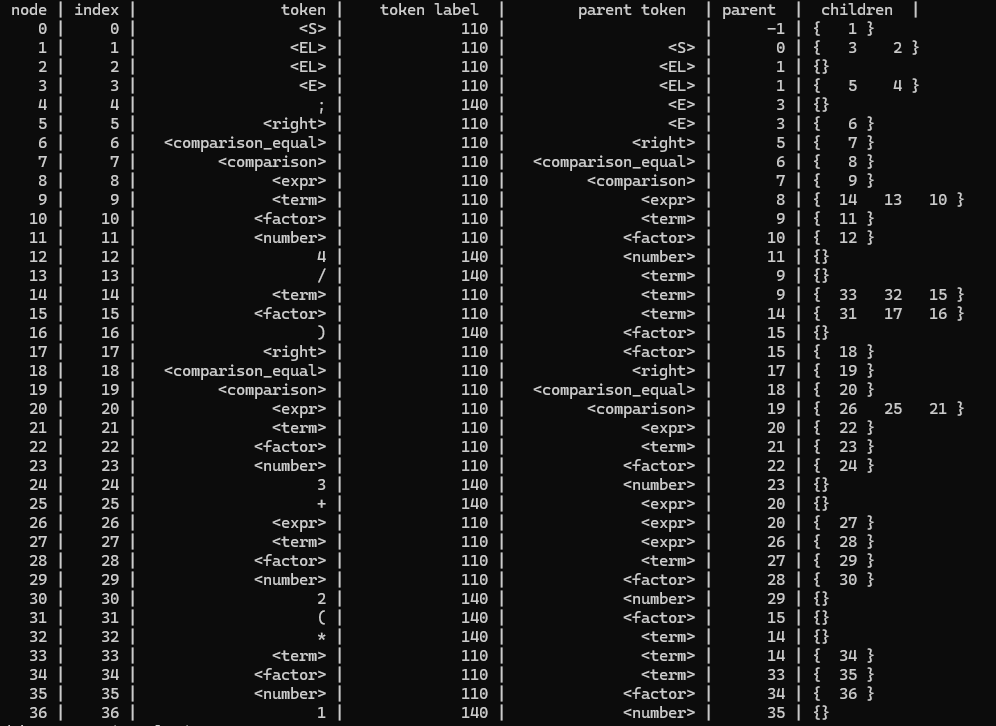
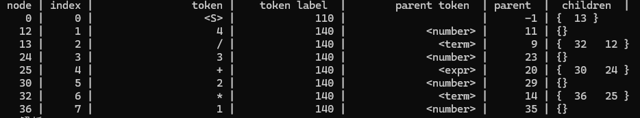
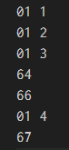

# SoftLoop

M5Stack 等マイコンにおいて動作する、宣言的 UI を念頭に置いたプログラミング言語とその処理系の開発

開発者

- 丸山拓真 2312110208

## はじめに

このプロジェクトでは、M5Stack など、ディスプレイ表示可能なマイコンにおいて、React のような、宣言的 UI によって画面のコーディングが可能かつ、容易にルーティングが可能な言語を開発する。このプロジェクトは国立研究開発法人情報通信研究機構 Sechack365 2023 年度において開発した、SoftLoop(34Dk)の派生である。

## 背景

昨今、Web フロントエンド分野においては、React 、 Next.js や Remix.js など、コンポーネントを主体にフロントエンド・画面を開発することができるライブラリやフレームワークが次々と誕生しており、一般企業においてもその技術が広く支持されはじめていることは明白である。画面の設計・開発は、手間のかかる作業である。しかし、宣言的 UI を用いれば、コンポーネントと呼ばれる部品単位で容易に構成でき、コンポーネント単位で再利用やテストができるため、前項の手間を少し、あるいは大幅に緩和している。テストツールも playwright や storybook など、次々と登場している。現に、丸山が非正規の技術職として所属している株式会社 toridori では、フロントエンド技術として Next.js や Remix.js を採用しており、丸山も担当している。

しかし、マイコンや、組み込みなどの分野は、その制約から、フロントエンド技術からは遠く離れているように見える。理由は明らかである。C 言語などで動いており、いかにメモリ容量を少なく、高速に、安定に動かすかが求められる組み込み機器に DOM レンダリングの思想を持ち込むのは、明らかに的外れで過剰である。また、軽量であることが求められ、場合によってはアセンブリを使用することが是とされるような分野に、npm や webpack のようなビルドツールを使用するような未来はなかなか見ることが出来ない。

## 目的

本ソフトウェアでは、マイコン上で動作する、宣言的 UI を念頭に置いた言語とその処理系を開発する。フロントエンド技術をマイコンへ持ち込み、宣言的 UI の利点を活かす言語を目標とする。これによって、フロントエンド技術者のマイコン開発の参入をより容易にする。前述の React 等との最大の違いは、言語そのものが宣言的 UI を念頭に置いているということである。これにより、軽量な宣言的 UI を実現することを目指す。実行方式は中間表現となるバイトコードを用いた実行方式を採用する。バイトコードは、構文木巡回による処理系と、アセンブリレベルでの処理系のそれぞれの利点・難点を調整し、その中庸を狙う方式である [^1] 。そのため、構文木巡回による処理の遅さと、アセンブリレベルでの実装の困難さ、移植の難しさのそれぞれの難点をカバーすることができる。実装には、過去に開発した構文解析表を生成・出力する文脈自由文法の処理プログラムを活用する。

## 各処理の構想と現状

### 言語仕様

現在の言語の構文規則は次のとおりである。これは文脈自由文法を表現する記法の一つである BNF にいくつかの独自記法を追加したものを用いて記述したものである。この構文規則を前述の文脈自由文法処理プログラムに入力することで、LR(1)法による決定性有限オートマトンを通した構文解析表を作成することができる。解析対象となる原始プログラムを字句解析し分割したトークンに対して、構文解析表を照らし合わせることで、その原始プログラムが構文規則に乗っ取っているか否かの判断、および具象構文木を作成することができる。すなわち、この構文規則を編集することによって、容易に構文解析が行うことができ、構文規則の制定から構文解析の試行までのサイクルを極めて短くすることができる。よって、完全な構文規則を定めずとも開発に取り掛かり、順次構文規則を修正していくことができる。なお、この構文規則は、まだ十分な規則ではないため、今後随時調整をする予定である。特に配列の構文規則は調整が必要である。この文脈自由文法を構文解析表に変換するアルゴリズムは、shift-reduce parser である LR(1)法[^2]を採用しているため、ほぼすべての構文規則を解析できる[^3]。すなわち構文解析表の構築においてその要素同士の衝突が発生しにくいという特徴を持っており、またバックトラックなしで構文解析することができる。

この独自 BNF 記法には、以下の特徴がある。

1.NUM や TEXT という特殊な終端記号を設定することで、任意の桁数の数字や、任意の長さのアルファベットを受理する構文規則を容易に定義することができる。これはあらかじめ字句解析において 数字だけ、もしくは文字列として構成されているか否かをラベリングしており、その情報を構文解析に渡すことによって、この機能を実現している[^4]

2.ダブルクォーテーションによって、終端記号を明示的に定義できる

3.行の末端に バーティカルバーを入力することで、容易に空集合（ε）の表現ができる

4.アスタリスク記号またクエスチョン記号で繰り返しの表現ができる

5.この独自 BNF 記法を解析するための字句解析器と構文解析器は、非常に単純な構造で作ることができる

6.もちろん、文脈自由文法を決定性有限オートマトンに変換する過程において、Null 集合、First 集合、Follow 集合の導出や、左再帰の削除も対応している

図 1 構文規則

### 構文木

LR(1)法による独自の文脈自由文法の処理系の構文解析の結果は、構文を受理できたか、すなわち構文解析に成功したか否かと、非終端記号を含めた構文木である。この出力された構文木は、非終端記号を含むだけではなく、クオーテーション記号や、カッコ記号などの、直接解析に必要がない、余分なノードが含まれているため、その後の処理モジュールで扱いやすい構文木に整理する必要がある。完全に非終端記号も削除したものを抽象構文木と呼ぶことが多いが、本処理系では、非終端記号をすべて削除しない。これは、有意な非終端記号をあえて残し、その非終端記号の存在をもとに構文木の走査を行うことによって、子要素数の違いなどを吸収することや、バイトコードに変換する過程でその非終端記号を利用するからである。PHP 言語において機械的なリファクタリングや、型推論を行うライブラリとして、PHPStan や Rector が知られているが、そのライブラリ で得られる構文木も、完全な抽象構文木ではなく、そのような構文木によって柔軟な型推論を行うことができる。また、子要素数の違いを吸収する方法として、二分木にまで変換するこことも考えられるが、少なくともこの言語では行わない。

### バイトコード生成

バイトコードの本質は、スタックマシンである。四則演算はもちろん、関数の呼び出しなども、おおよそすべてスタックで処理することができる。これは極めて効率的で、ポーランド記法や逆ポーランド記法、また抽象構文木など木構造との親和性が高く、コンピュータの実態に即した演算方法である。最も簡単な言語ともいえる数式をバイトコードに変換する過程を図 1、図 2、図 3 で示す。また、バイトコードのオペコードについては、暫定的に、それぞれ 10 進数表記で足し算を 100、引き算を 101、掛け算を 102、割り算を103、スタックへの push を 001 に割り当てている。バイトコード上では16進数に変換されている。

  
図 2 数式を構文解析した様子

 
図 3 構文木を整理した様子

 
図 4 バイトコードに変換したもの

### バイトコード実行

バイトコードを実行する際に問題になるのは、いかに効率よく、スタックマシンを動作させるかである。また、変数がどの階層に影響を与えるか、すなわち変数のスコープの実現についても考慮しなければならない。そのため、関数呼び出しなどサブルーチン等については、いわゆるコールスタック(Call Stack)として、その実行に必要な情報をスタック構造としてみ重ねていく言語が多い。例として、JavaScript(ECMAScript) においては Global Execution Context や Functional Execution Context と呼ばれるコンテキストを積み上げることによって、変数スコープを実現している。しかし、M5Stack の場合は、使用できるメモリが 16MB 程度のため、JavaScript のようにメモリを潤沢に使用することはできない。愚直に構造体を積み上げていくようなことをすれば、容易にそのメモリ制限を超えてしまうことが予想される。そのため、そのデータ構造は細心の注意が必要である。現在、m5stack のメモリ量でも十分に動作するスタックマシンの構造を模索している。

## 参考文献

なお、下記の文献を用いて言語処理系の開発も行っている。
[^1]: Robery Nystrom 著 吉川邦夫 訳 ,CRAFTING INTERPRETERS インタプリタの作り方 -言語設計/開発の基本と 2 つの方式による実装-,株式会社インプレス,2023 年
[^2]: 大堀淳, LR 構文解析の原理, コンピュータソフトウェア, vol.31, no.1, pp. 1_30 - 1_42, 2014 年
[^3]: Andrew W Apple 著 神林 靖・滝本 宗宏 翻訳 ,最新コンパイラ構成技法(⽇本語訳) Modern Compiler Implementation in ML New Edition , 翔泳社 , 2009 年
[^4]: ⼭下義⾏ 著 ,コンパイラ⼊⾨ -構⽂解析の原理と lex yacc C ⾔語による実装- ,サイエンス社, 2008 年
